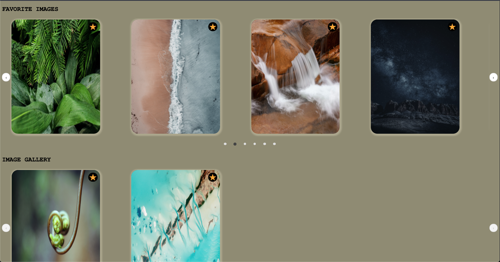

# Image-Gallery

## Instructions:

Clone repository
Run `npm install` in base directory of project

If you don't have postgres install do so following this (first install brew if needed):
`brew doctor`
`brew update`
`brew install postgresql`

To seed Postgres database run `brew services start postgresql`
`psql postgres`
`\i server/schema.sql`

To start application run `npm run build`
In separate command window (while above command is still running) run `npm run start`

## Next Steps:

Use the [exif](https://www.npmjs.com/package/exif) npm package to extract metadata
Add another button to each image to have a modal with metadata show up for image

## Preview:

